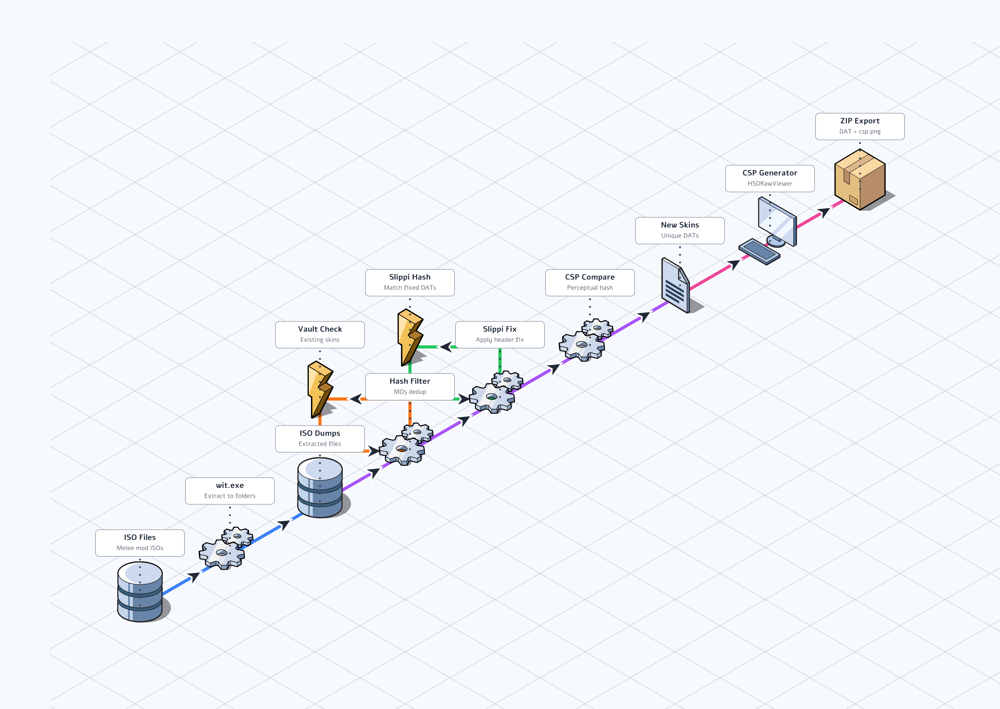

# ISO Migration Tool

Extract skins from Melee mod ISOs and export them as import-ready ZIP packages.



## Location

`scripts/tools/scan_iso_dumps.py`

## Usage

```bash
# Extract ISOs first (one-time)
python scan_iso_dumps.py --extract path/to/*.iso

# Scan and export all new skins
python scan_iso_dumps.py

# Export only one character
python scan_iso_dumps.py --char Fox

# Test with limited export
python scan_iso_dumps.py --char Fox --limit 5

# Scan only, no export
python scan_iso_dumps.py --no-export

# Enable CSP comparison pass (slower, catches slot-dupes)
python scan_iso_dumps.py --csp
```

## Pipeline

1. **Extract ISOs** - Uses `wit.exe` to extract ISO contents to `ISO DUMPS/` folder
2. **Hash Filter** - MD5 hash each DAT, skip duplicates and vanilla costumes
3. **Vault Check** - Skip skins already in the vault (by hash)
4. **Slippi Fix Check** - Apply Slippi header fix, check if fixed hash matches vault
5. **CSP Compare** (optional) - Generate CSP, perceptual hash to catch slot-duplicates
6. **Export** - Create ZIP packages with Slippi-fixed DAT + generated CSP

## Output Format

```
output/new_skins_from_dumps/
  Fox/
    PlFxNr_a1b2c3d4.zip
    PlFxBu_e5f6g7h8.zip
  Marth/
    PlMsNr_i9j0k1l2.zip
```

Each ZIP contains:
- `PlXxYy.dat` - Slippi-fixed costume DAT
- `csp.png` - Auto-generated character select portrait

## Known Issues / TODO

Characters with special handling needed:

| Character | Issue | Status |
|-----------|-------|--------|
| Ice Climbers | Needs Popo+Nana pair matching | Partial |
| Kirby | Copy abilities affect CSP | TODO |
| C. Falcon (Red) | Unknown color detection fails | TODO |
| Mr. Game & Watch | Limited scene support | TODO |

## Dependencies

- `wit.exe` - Wiimms ISO Tools for extraction
- `HSDRawViewer` - CSP generation
- Vault metadata for hash comparison
